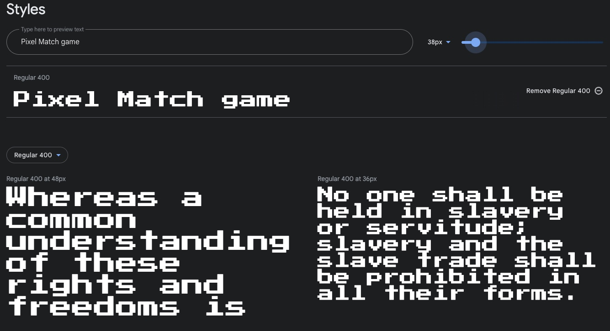
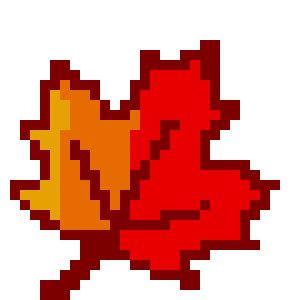
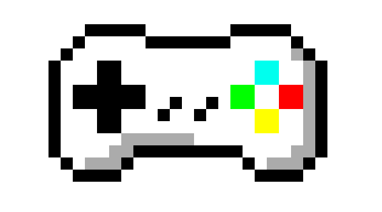

# Pixel Match by Adam Weaver

This game was built to get players to test there memory skill. I have styled the game with pixaliated font and images to give it a retro feel. I have a start button to initailise the game. A timer and move set for the player to follow and a stop button when they have finished. When this happens I have a results model that will pop up to give the player their results.
 
## [View Game here](https://github.com/AdamWeaver94/project_2)

## Colour Palette
| Color             | Hex                                                                |
| ----------------- | ------------------------------------------------------------------ |
| Game Logo |  #FF0000 |
| Start/Stop button |  #AA0000 |
| Card background colour |  #FFFFFF |

## Font

I used Press Start 2P font style from [Google Fonts](https://fonts.google.com/specimen/Press+Start+2P?query=Press+Start+) to coinside with the style I was creating. I liked the retro look of the front and found it fitting with the overal design of the game.

## Backgound

I gave the game a background that is fitting witht the overall style. The image was found on google images but would, if had enough time, to create my own artwork.

## Images

All images were sourced from google images. I kept to the pixel style aspect to keep it within the look I was aiming for.

## Features

The game contains only one page. I has a interacting start/stop button to activate the game in different ways.

The timer is activated when a player starts with a move count there to allow the payer to monitor how many turns it has taken them. This gives the player a challange to improve with their pace and winning with less moves. 

I also have a results model that will allow the player to se there overall results.

# Tools used

- [Github](https://github.com/) & [Gitpod](https://gitpod.io/) For version control, safe storage and deployment. Web based IDE. 
- [Google Dev Tools](https://developer.chrome.com/docs/devtools/) For testing and debugging
- [Am I Responsive?](https://ui.dev/amiresponsive?url=https://jaycode88.github.io/msp-1) To create visuals for responsive design in [Read.me](https://github.com/AdamWeaver94/project_2/blob/main/README.md) file.
- [W3 HTML Validator](https://validator.w3.org/) Was used to validate my HTML.
- [W3 Jigsaw CSS Validator](https://jigsaw.w3.org/css-validator/) Was used to validate

# Deployment

The website was deployed on Github pages. To deploy follow these steps.

- In the [Github Repository](https://github.com/AdamWeaver94/project-1)
- Go to settings
- From side menu, select pages and navigate to source drop down menu
- Choose deploy from branch and select save

The link to the website is [here](https://adamweaver94.github.io/project_2/)

# Credit

## Images

All image are sourced from google images. 
Refer to this link [here](https://github.com/AdamWeaver94/project_2/tree/main/assests/images) for images saved from google.

## Inspiration on creating the game layout

- (https://codingartistweb.com/2022/06/memory-game-javascript-project/)
- (https://marina-ferreira.github.io/tutorials/js/memory-game/)
- (https://webtips.dev/memory-game-in-javascript)
- (https://www.w3schools.com/howto/howto_css_modals.asp)

## Room for improvment?

I would like to include more levels to the game, to make it more engaging for a user. This would come in stages and more matching cards could be introduced.
Possibly a leaderboard could be added for users to keep track of there progress. This would require a player details entry and database to store scores.
It could be interesting to change the theme of the levels while the player is progessing for a more imersive playthrough.

# Testing

Please refer to my [test.md](https://github.com/AdamWeaver94/project_2/blob/main/test.md).

# Acknowledgement

- Thanks goes out to family and friends. For helping me develop my website to become more user freindly.

- Thanks to Greame my mentor. For all the guidence along the way and motivation to keep up th