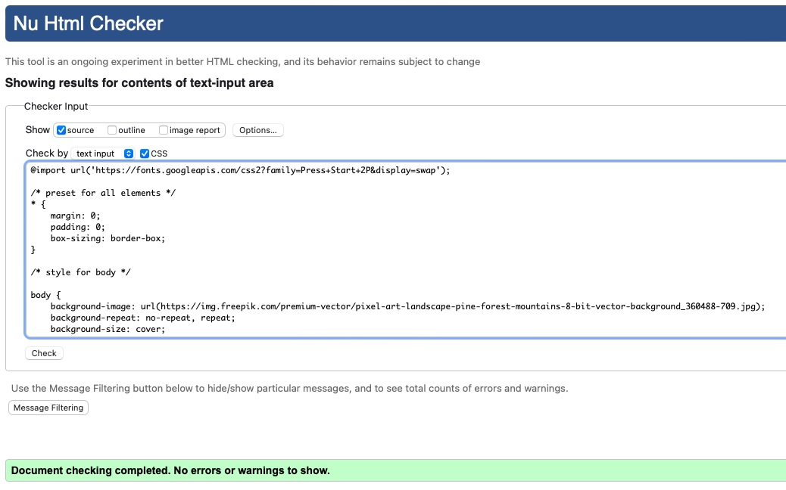

# Testing

Return back to [Read.me](https://github.com/AdamWeaver94/project_2/blob/main/README.md)

## Validating

### HTML

I have used [HTML W3C Validator](https://validator.w3.org/nu/#textarea) and these are the following results.

[Index Page Result](https://github.com/AdamWeaver94/project_2/blob/main/index.html)

### CSS Stylesheet

[CSS Result](https://github.com/AdamWeaver94/project_2/blob/main/assests/css/style.css)

### Javascript 

[Javascript Result](https://github.com/AdamWeaver94/project_2/blob/main/assests/js/script.js)

## Lighthouse Performance

I tested out the performance of the desktop and mobile version to find any issues. I used the Lighthouse Audit tool.

### Desktop

# Debugging

I used the code validator along the way to debug my code for any errors I may have encountered. I used the slack community to help with any issues as well. Also doing my own researched in the best ways to code.
CodeInstitutes guides also helped when stuck with a code that I couldn't work out. 